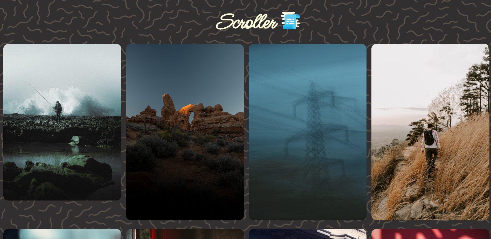
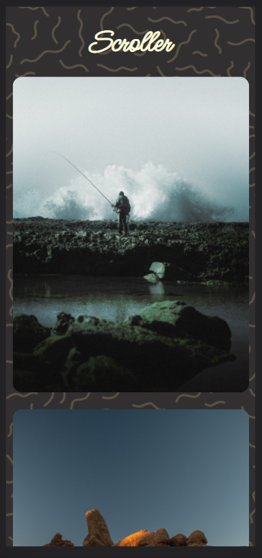

# Scroller 📜

## Scroller It the Small App that allow you download the most Beautiful Images and it has unlimited Scrolling 😏

# Documentation 📃

1. [API Used](https://unsplash.com/documentation)
2. [HTML](https://developer.mozilla.org/en-US/docs/Web/HTML)
3. [CSS](https://developer.mozilla.org/en-US/docs/Web/CSS)
4. [JavaScript](https://developer.mozilla.org/en-US/docs/Web/JavaScript)

# Learn More About the API

1.  [API Fetching 🤙🏼](https://developer.mozilla.org/en-US/docs/Web/JavaScript/Reference/Statements/async_function)

# Demo

## [Live Demo 💻](https://scroller-infinity.netlify.app/)

 

# Screenshots 🖼️

<h2>Desktop Version</h2>

 

<h2>Mobile Version</h2>

## Features 😁

- Download the Image You Like 😍
- Live previews
- HDR Images
- All Categories Included

 

# Authors

## [@mohammedkharodawala 😁](https://github.com/mohammedkharoda)
